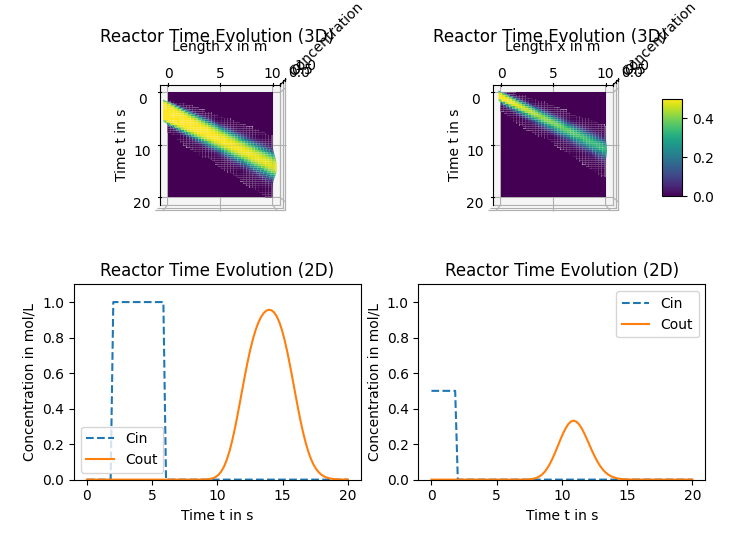
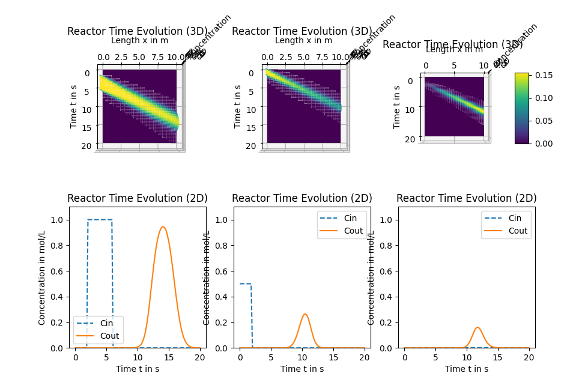
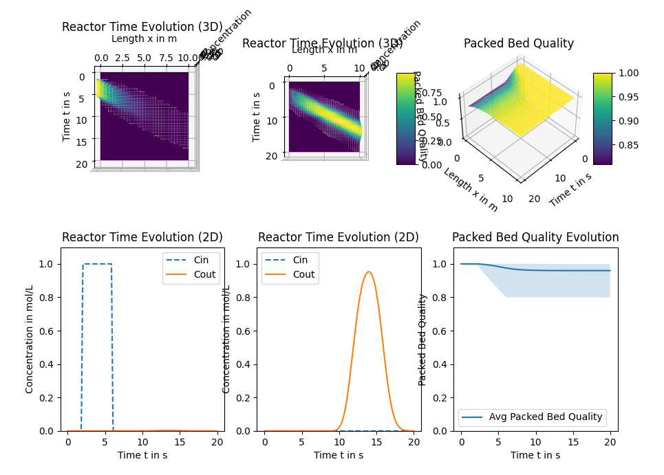

# PyFlow
Implementations of a flow reactor within Python.

## Flow Reactor

The FlowReactor class provides a compact and straightforward implementation of a flow reactor based on the axial dispersion model, which is semi-discretized in the spatial direction. The simulate method allows users to simulate the reactor for specified inlet concentrations, total flow rate, and temperature. It also supports stepwise simulations that reuse the previous state, and includes functionality to visualize the reactor’s time–space behavior.

### Simple example

Consider a flow reactor of length 10 m and diameter 0.8 mm in which two species are flwoing. The inlet concetrations vary over time and the total flow rate is given with 1 m/s. After simulating the reactor for 20 seconds one can see, that the input cocnetrations will experience a delay and dispersion effects throut the reactor as seen in the figure below.

### Simple example including a reaction

Considering the same reactor as before, we now assume that the first and second species react to form a third species within the reactor. The reaction follows the Arrhenius rate law and therefore depends on temperature. After simulating the reactor, we observe that the first and second species are consumed along the reactor, while the third species is formed, as seen at the reactor outlet.

## Packed Bed Flow Reactor

The Packed Bed Flow Reactor class models a reactor containing a packed bed, where the bed’s quality can affect reaction performance and may deteriorate over time during operation.

### Simple example of a packed bed flow reactor where the inlet reacts with the catalyt / packed bed

Consider a flow reactor with an effective length of 10 m and an effective diameter of 0.8 mm, in which a catalyst plays a key role. A single species with a defined inlet concentration enters the reactor, where it reacts with the catalyst. As the reaction proceeds, the species is consumed, a new species forms, and the catalyst gradually loses activity over time and along the reactor length.

## Examples

| Filename | Rechts |
|:------|:-------|
| A0_SimpleExample | Simple reactor used for simulation |
| A1_SimpleReactionExample | Simple reactor with a reaction |
| A2_SimpleReactionExample_StepByStepSim | Simple step-by-step simulation of reactor |
| B0_SimplePackedBedExample | Simple packed bed flow reactor |
| B1_SimplePackedBedExample_StepByStepSim | Simple step-by-step simulation of a packed bed flow reactor |
| B2_PackedBedExample_StoppingFlowRate.py | Packed bed flow reactor where flow rate is switched to zero |