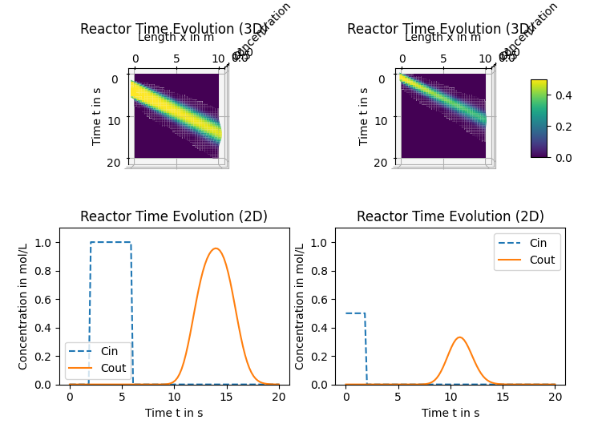
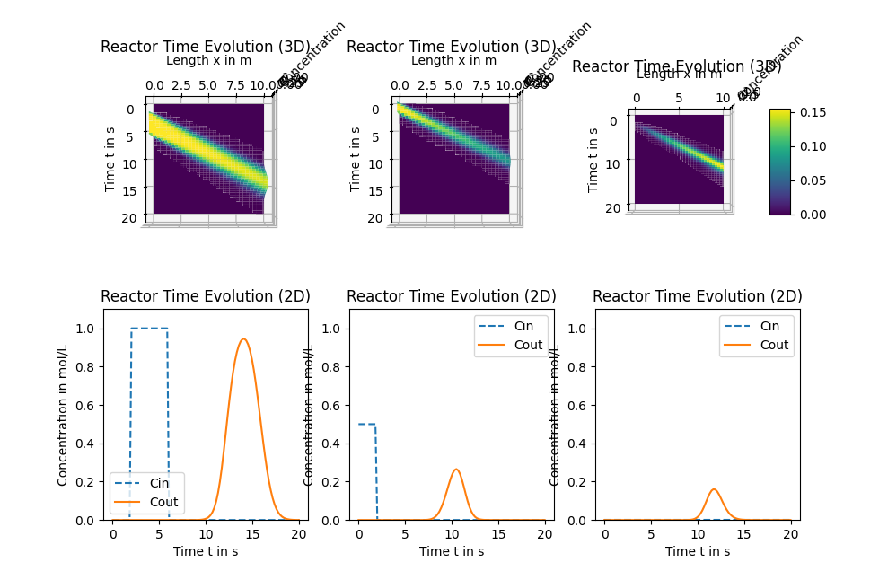

# PyFlow
Implementations of a flow reactor within Python.

The FlowReactor class provides a compact and straightforward implementation of a flow reactor based on the axial dispersion model, which is semi-discretized in the spatial direction. The simulate method allows users to simulate the reactor for specified inlet concentrations, total flow rate, and temperature. It also supports stepwise simulations that reuse the previous state, and includes functionality to visualize the reactor’s time–space behavior.

## Simple example

Consider a flow reactor of length 10 m and diameter 0.8 mm in which two species are flwoing. The inlet concetrations vary over time and the total flow rate is given with 1 m/s. After simulating the reactor for 20 seconds one can see, that the input cocnetrations will experience a delay and dispersion effects throut the reactor as seen in the figure below.

## Simple example including a reaction

Considering the same reactor as before, we now assume that the first and second species react to form a third species within the reactor. The reaction follows the Arrhenius rate law and therefore depends on temperature. After simulating the reactor, we observe that the first and second species are consumed along the reactor, while the third species is formed, as seen at the reactor outlet.

